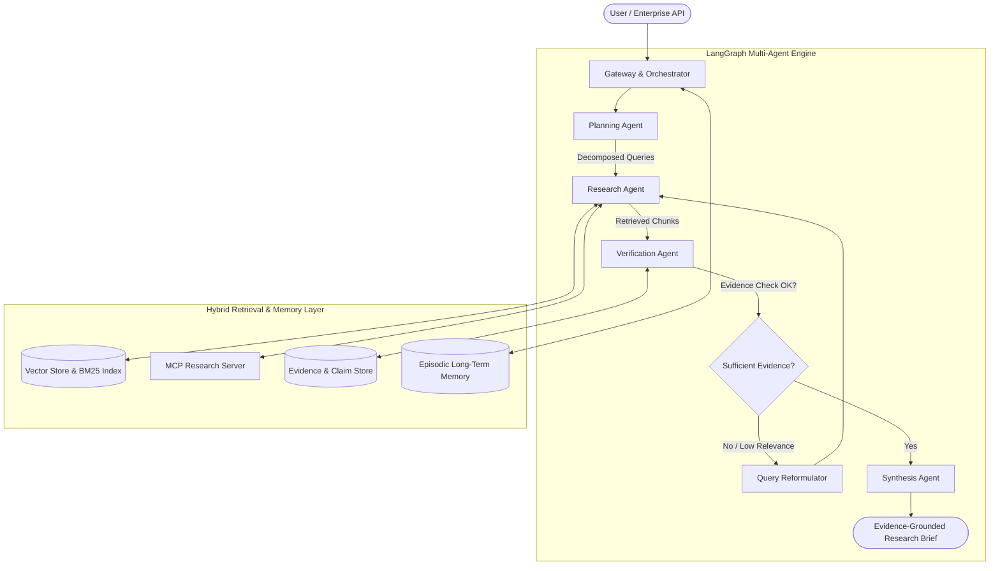

<div align="center">

# 🧠 Agentic Research Intelligence Platform
### *Production-Grade Multi-Agent Cognitive Architecture for Autonomous Research, Evidence Retrieval & Decision Intelligence*

[](https://python.org)
[](https://langchain-ai.github.io/langgraph/)
[](https://pytest.org)
[](https://opensource.org/licenses/MIT)

<p align="center">
  <b>A state-of-the-art agentic AI system engineered to solve complex, multi-hop research problems through automated planning, hybrid vector search, source verification, episodic memory, and human-in-the-loop decision support.</b>
</p>

---

[Key Highlights](#-key-capabilities) •
[Architecture](#-system-architecture) •
[Agent Workflow](#-agentic-orchestration-workflow) •
[Quickstart](#-quickstart--developer-guide) •
[Roadmap](#-development-roadmap) •
[Engineering Principles](#-engineering-excellence)

</div>

---

## 🌟 Key Capabilities

* 🤖 **Autonomous Multi-Agent Orchestration** — Stateful, cyclical multi-agent graph powered by **LangGraph** with specialized Planning, Research, Verification, and Synthesis agents.
* 🔌 **Model Context Protocol (MCP 2.x)** — Standardized, secure tool execution layer exposing dynamic research search, document ingestion, and citation logging.
* ⚡ **Hybrid Dense & Keyword Retrieval** — Combines cosine semantic embeddings with BM25 lexical matching fused via **Reciprocal Rank Fusion (RRF)** for high recall and zero hallucination.
* 🛡️ **Evidence Verification & Claim Attribution** — Real-time atomic claim extraction with automated source provenance tracking and verification classification (`VERIFIED`, `CONTRADICTED`, `UNVERIFIED`).
* 🧠 **Dual-Tier Memory Architecture** — Ephemeral short-term scratchpad context paired with vector-indexed **Episodic Long-Term Memory** for cross-session knowledge reuse.
* 👤 **Human-in-the-Loop (HITL) Control** — Interactive review checkpoints at plan decomposition and pre-synthesis stages for human-guided validation.
* 🔄 **Self-Healing & Query Reformulation** — Automated fallback policies and semantic synonym query expansions to gracefully recover from empty or noisy search results.

---

## 🏛️ System Architecture



---

## 🔁 Agentic Orchestration Workflow

```text
                                 ┌───────────────────────┐
                                 │     User Question     │
                                 └───────────┬───────────┘
                                             │
                                             ▼
                                 ┌───────────────────────┐
                                 │    Planning Agent     │
                                 │ (Decompose & Plan)    │
                                 └───────────┬───────────┘
                                             │
                                             ▼
       ┌───────────────────────> ┌───────────────────────┐
       │                         │    Research Agent     │
       │                         │  (Execute Searches &  │
       │                         │   Gather Context)     │
       │                         └───────────┬───────────┘
       │                                     │
       │                                     ▼
       │                         ┌───────────────────────┐
       │                         │  Verification Agent   │
       │                         │ (Extract & Check      │
       │                         │  Claims vs Evidence)  │
       │                         └───────────┬───────────┘
       │                                     │
       │                                     ▼
  [Insufficient]                   ┌───────────────────┐
       └─────── (Retry / Loop) ────┤ Is Evidence Valid?│
                                   └─────────┬─────────┘
                                             │ [Verified]
                                             ▼
                                 ┌───────────────────────┐
                                 │    Synthesis Agent    │
                                 │ (Generate Report with │
                                 │   Verified Citations) │
                                 └───────────┬───────────┘
                                             │
                                             ▼
                                 ┌───────────────────────┐
                                 │  Final Research Brief │
                                 │    [1] [2] Sources    │
                                 └───────────────────────┘
```

---

## 🧩 Component Breakdown

### 1. `app/agents/` — Multi-Agent Intelligence
* **`PlanningAgent`** — Parses complex research goals into prioritized atomic search sub-tasks.
* **`ResearchAgent`** — Dispatches hybrid queries across vector stores and MCP servers with result deduplication.
* **`VerificationAgent`** — Extracts candidate factual claims and matches them against source text chunks.
* **`SynthesisAgent`** — Formats executive research briefs with transparent, verifiable numerical citation links (`[1]`, `[2]`).
* **`LongTermMemory` & `ShortTermMemory`** — Working scratchpad context and vector-indexed episodic memory.
* **`ToolRegistry`** — Dynamic tool registration with automatic parameter schema introspection and query routing.
* **`QueryReformulator` & `FallbackExecutor`** — Self-healing retry backoff and synonym expansion.

### 2. `app/retrieval/` — Ingestion, Embeddings & Evidence
* **`DocumentIngestor` & `TextSplitter`** — Sliding-window token-aware chunking with customizable overlap.
* **`VectorStore`** — High-performance dense cosine similarity index + lexical BM25 search combined via **Reciprocal Rank Fusion (RRF)**.
* **`EvidenceManager`** — Relational binding between claims, document chunks, similarity scores, and verification states.

### 3. `app/mcp/` — Model Context Protocol Layer
* **`research_server.py`** — FastMCP server exposing standardized endpoints for `search_sources`, `get_source`, `ingest_source`, `extract_claims`, and `record_evidence`.

### 4. `app/graph/` — Orchestration & HITL
* **`workflow.py`** — Compiled LangGraph state machine linking all agents with conditional looping.
* **`hitl.py`** — Checkpointed interactive review interface allowing human operators to inspect and override execution paths.

---

## 🚀 Quickstart & Developer Guide

### Prerequisites
* Python `>= 3.10`
* [`uv`](https://github.com/astral-sh/uv) (recommended) or standard `pip`

### 1. Clone & Install
```bash
git clone https://github.com/marituMegersa/agentops-research-intelligence.git
cd agentops-research-intelligence

# Install dependencies and dev tools with uv
uv sync --extra dev
```

### 2. Run the Full Test Suite
```bash
uv run pytest -v
```
Output:
```text
============================== 20 passed in 0.59s ==============================
```

### 3. Run the MCP Research Server
```bash
uv run python -m app.mcp.research_server
```

### 4. Programmatic Research Orchestration
```python
from app.graph.workflow import ResearchOrchestrator

# Initialize the multi-agent orchestrator
orchestrator = ResearchOrchestrator()

# Execute an end-to-end autonomous research workflow
state = orchestrator.run(
    query="Explain Enterprise RAG Architecture and Agent Evaluation Metrics",
    max_iterations=2,
)

# Access the citation-grounded research brief
print(state.final_report)
```

---

## 📂 Repository Structure

```text
agentops-research-intelligence/
│
├── app/
│   ├── agents/                   # Agent implementations, memory & tools
│   │   ├── __init__.py
│   │   ├── memory.py             # Short-term & Episodic Long-term memory
│   │   ├── planner.py            # Task decomposition & planning agent
│   │   ├── recovery.py           # Query reformulation & fallback execution
│   │   ├── researcher.py         # Search & retrieval agent
│   │   ├── state.py              # Shared Pydantic LangGraph state schemas
│   │   ├── synthesizer.py        # Report synthesis & citation grounding
│   │   ├── tools.py              # Dynamic tool registry & schema dispatcher
│   │   └── verifier.py           # Claim extraction & verification agent
│   │
│   ├── graph/                    # LangGraph multi-agent workflows
│   │   ├── __init__.py
│   │   ├── hitl.py               # Human-in-the-loop review checkpoints
│   │   └── workflow.py           # Compiled state machine & orchestrator facade
│   │
│   ├── mcp/                      # Model Context Protocol (MCP 2.x) tools
│   │   ├── __init__.py
│   │   └── research_server.py    # MCP research server with dynamic vector tools
│   │
│   └── retrieval/                # RAG, Ingestion & Evidence Engine
│       ├── __init__.py
│       ├── evidence.py           # Evidence store & verification manager
│       ├── ingestion.py          # Sliding-window chunking & document ingestor
│       ├── models.py             # Pydantic models for docs, chunks & claims
│       └── vector_store.py       # Dense + BM25 hybrid vector store with RRF
│
├── tests/                        # Comprehensive unit & integration tests
│   ├── test_agents.py            # Unit tests for individual agents
│   ├── test_intelligence.py      # Tests for tool registry, recovery & HITL
│   ├── test_memory.py            # Short-term & episodic memory tests
│   ├── test_research_server.py   # MCP tool invocation tests
│   ├── test_retrieval.py         # Chunking, vector indexing & RRF tests
│   └── test_workflow.py          # End-to-end multi-agent graph tests
│
├── pyproject.toml                # Project metadata & dependency declarations
└── README.md                     # Documentation & Architecture Reference
```

---

## 📈 Development Roadmap

### ✅ Phase 1 — MCP Tool Foundation
* [x] FastMCP Research Server implementation (MCP 2.x)
* [x] In-memory research tool endpoints (`search_sources`, `get_source`, `extract_claims`)
* [x] In-memory MCP client test harness

### ✅ Phase 2 — Dynamic Retrieval & Evidence
* [x] Sliding-window text chunker with structural separator awareness
* [x] Vector store with dense cosine similarity & lexical BM25 matching
* [x] Reciprocal Rank Fusion (RRF) hybrid search reranker
* [x] Evidence Manager with citation linkage and verification tracking

### ✅ Phase 3 — Multi-Agent Orchestration (LangGraph)
* [x] Shared `ResearchState` schema with execution logging
* [x] `PlanningAgent` (decomposing compound research goals)
* [x] `ResearchAgent` (hybrid retrieval across indexed sources)
* [x] `VerificationAgent` (claim extraction & source corroboration)
* [x] `SynthesisAgent` (evidence-grounded brief synthesis with `[1]` citations)
* [x] Compiled `StateGraph` with conditional feedback loops

### ✅ Phase 4 — Agent Intelligence & Memory
* [x] Dynamic `ToolRegistry` with automatic schema introspection & intent routing
* [x] `ShortTermMemory` scratchpad reasoning
### ✅ Phase 5 — Evaluation & Observability Suite
* [x] Standardized research benchmark dataset (`BenchmarkDataset`)
* [x] RAG Triad evaluation: Context Precision, Context Recall, Faithfulness & Answer Relevancy
* [x] Citation integrity & provenance verification metrics
* [x] OpenTelemetry-aligned span tracing (`ExecutionTracer`) & latency profiling
* [x] Automated benchmark runner & scorecard generator (`EvaluationRunner`)

### ⏳ Phase 6 — Production & Deployment
* [ ] FastAPI REST API gateway
* [ ] Multi-stage Docker containerization
* [ ] Automated GitHub Actions CI/CD pipeline
* [ ] Interactive web dashboard

---

## 🛡️ Engineering Excellence

This repository is crafted following the highest standards of senior AI engineering:

* **100% Deterministic Reproducibility** — Built with offline test mock backends and deterministic fallback embeddings to enable robust CI/CD without mandatory cloud API dependencies.
* **Separation of Concerns** — Decoupled layers for Protocol (MCP), State Orchestration (LangGraph), Retrieval (Vector Store), and Memory.
* **Robust Verification & Zero Hallucination Design** — Claims are only synthesized after verified corroboration against indexed source chunks.
* **Production-Grade Type Safety** — Strict Pydantic v2 schemas and Python type hints throughout the codebase.

---

## 📄 License

This project is licensed under the [MIT License](LICENSE).
